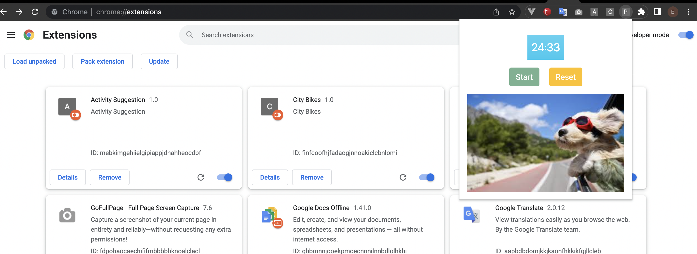

# chrome-extension-pomodogo
<br>

```bash
Go to this url on chrome >> chrome://extensions/
```

```bash
Open "developer mode" from off to on
```

```bash
Click "Load unpacked" and choose project folder
```

